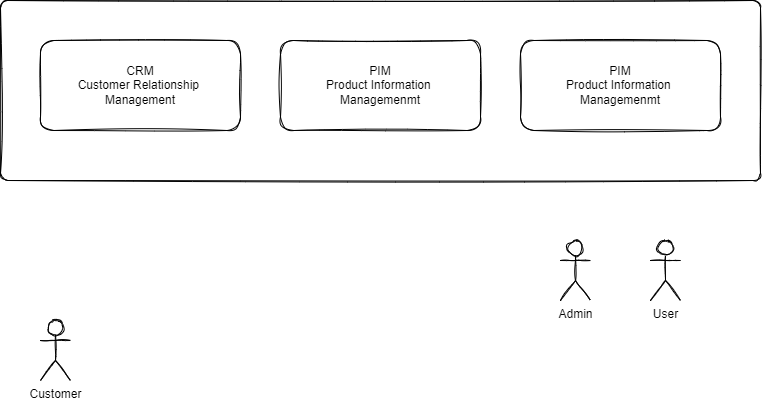

[comment]: https://developers.redhat.com/blog/2020/11/24/authentication-and-authorization-using-the-keycloak-rest-api#

# Authentication and authorization using the Keycloak
Lets understand the difference between **authentication** and **authorization**, authentication means _who you are_ while authorization means _what can you do_, with each approach using separate methods for validation. For example authentication uses the user management and login form, and authorization uses role-based access control (RBAC) or an access control list (ACL). 

###Download and install keycloak
[comment]: (https://www.youtube.com/watch?v=HOwoNMoQkmw)
Default admin credentials 
* Username - Admin
* Password - Pa55w0rd

###Create new realm
Create a new Keycloak Realm, using the Add realm dialog box. Name the realm _zestic_, set Enabled to ON, and click Create.

###Create realm roles
Next, go to the Roles page and make sure the Realm Roles tab is selected, create below roles
* admin
* customer
* user

###Create clients
Then, using the Clients page, click Create to add following client
* gateway
  * Client ID: gateway
  * Enabled: ON
  * Access Type: confidential
  * Standard Flow Enabled: ON
  * Implicit Flow Enabled: ON
  * Service Account Enabled: ON
  * Authorization Enabled: ON
  * Valid Redirect URI: http://<ipaddress:port>/login/oauth2/code/gateway
  * Backchannel Logout Revoke Offline: ON    
* admin
  * Client ID: jakarta-school
  * Enabled: ON
  * Consent Required: OFF
  * Client Protocol: openid-connect
  * Access Type: confidential
  * Standard Flow Enabled: ON
  * Impact Flow Enabled: OFF
  * Direct Access Grants Enabled: ON
  * At the bottom of the same page, on the Authentication Flow Overrides part
    * Browser Flow: browser
    * Direct Grant Flow: direct grant
  * Go to the Roles tab, click Add Role,
    * create
    * view
* customer
  * Client ID: jakarta-school
  * Enabled: ON
  * Consent Required: OFF
  * Client Protocol: openid-connect
  * Access Type: confidential
  * Standard Flow Enabled: ON
  * Impact Flow Enabled: OFF
  * Direct Access Grants Enabled: ON
* user
  * Client ID: jakarta-school
  * Enabled: ON
  * Consent Required: OFF
  * Client Protocol: openid-connect
  * Access Type: confidential
  * Standard Flow Enabled: ON
  * Impact Flow Enabled: OFF
  * Direct Access Grants Enabled: ON
* supplier  
  * Client ID: jakarta-school
  * Enabled: ON
  * Consent Required: OFF
  * Client Protocol: openid-connect
  * Access Type: confidential
  * Standard Flow Enabled: ON
  * Impact Flow Enabled: OFF
  * Direct Access Grants Enabled: ON
* delivery
  * Client ID: jakarta-school
  * Enabled: ON
  * Consent Required: OFF
  * Client Protocol: openid-connect
  * Access Type: confidential
  * Standard Flow Enabled: ON
  * Impact Flow Enabled: OFF
  * Direct Access Grants Enabled: ON

##Preconditions
### Keycloak installation and configuration
* Create a realm __customers__
* Create client __api-services__ to secure microservices
    * Client ID - api-services
    * Name - api-services
    * Description - This is to secure microservices
    * Enabled - On
    * Consent Required - Off
    * Login Theme - Keycloak
    * Client Protocol - openid-connect
    * Access Type - bearer-only
    * Front Channel Logout - Off
    * Admin Url - http://127.0.0.1:9080/
    * Add role __user-admin-user__ and __user-admin-admin__
    

* Create client "__frontend__"
    * Enabled - __On__
    * Client protocol: **openid-connect**
    * Access Type: **public**
    * Standard workflow enabled: **On**
    * Direct Access Grants Enabled: **On**
    * Root URL: **http://127.0.0.1:9090**
    * Valid Redirect URIs: **http://127.0.0.1:9090/***
    * Admin URL: **http://localhost:4200**
    * Web Origins: **http://localhost:4200**

* Create client __backend__
    * Enabled: __On__
    * Client protocol: **openid-connect**
    * Access Type: **confidential**
    * Standard workflow enabled: **On**
    * Direct Access Grants Enabled: **On**
    * Root URL: **http://localhost:9090**
    * Valid Redirect URIs: **http://localhost:9090/***
    * Admin URL: **http://localhost:9090**
    * Web Origins: **http://localhost:9090**
    * Generate __Secret__ in __Credentials tab__

Step 2: Login using admin user

Step 3: Create a new Realm, Under general set enabled = true, User-Managed Access = false, In Realm settings under 
login tab i have set require SSL = none. If its set to none all your APIs will be on http. You can also configure 
email server configuration in email tab. Normally keycloak uses email server to verify user email. In this section 
you can configure email server.
####https://www.youtube.com/watch?v=tJc-gHnfEp4
####https://www.youtube.com/watch?v=J0GWqfhs4ys

Step 4: Creating user
####https://www.youtube.com/watch?v=qlr6u_l_HQY

###Do Keycloak Clients have a Client Secret?
####Your client need to have the access-type set to confidential , then you will have a new tab credentials where you will see the client secret.

After we create a user we need to add roles to that user. Goto Role mapping select client roles - "realm-management" from 
available roles select "realm-admin" role for this user.

